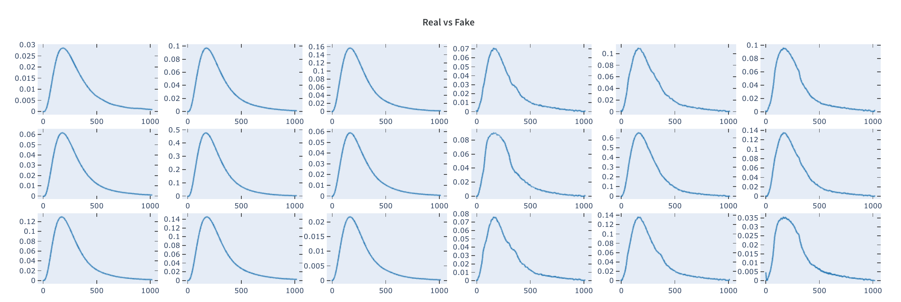

# Generative models applied to High Energy Physics problems

A source code for my Bachelors thesis at Higher School of Economics.
A corresponding thesis text can be found at [resources folder](resources/thesis.pdf).

## Generation Examples

## Summary

  - [Getting Started](#getting-started)
  - [Installing](#installing)
  - [Config](#config)
  - [Data Preparation](#data-preparation)
  - [Train](#train)
  - [Coding style tests](#coding-style-tests)
  - [Authors](#authors)
  - [License](#license)
  - [Acknowledgments](#acknowledgments)

## Getting Started

To install the package go to installing notes. All requirements can be found at setup.py

## Installing

To install the package run the following command

    pip install -e .

## Config

Before running the code adapt the [config file](generation/config.py) for your setup. Initially it supposes that you have raw root files at `ROOT_FILES_DIR` directory.

Additionally you can tune processing parameters, that include signal dimension. There are separate config files for training each model, `SIGNALS_TRAINING_CONFIG` can be taken for a reference.

## Data Preparation

First we need to extract raw data

    cd tools/data_preparation
    python extract_raw_data.py

Second we prepare dataframes for different events

    cd tools/data_preparation
    python prepare_dfs.py

Third we prepare signals data

    cd tools/data_preparation
    python prepare_signals.py

Lastly we postprocess our signals

    cd tools/data_preparation
    python postprocess_signal.py

## Train

To run training modify config file accordingly and run:

    cd tools/train
    python train.py -m MODEL_NAME

## Coding style tests

YAPF is used for coding style validation

    python3 -m yapf -rp . --in-place

## License

This project is licensed under the [MIT License](LICENSE)
